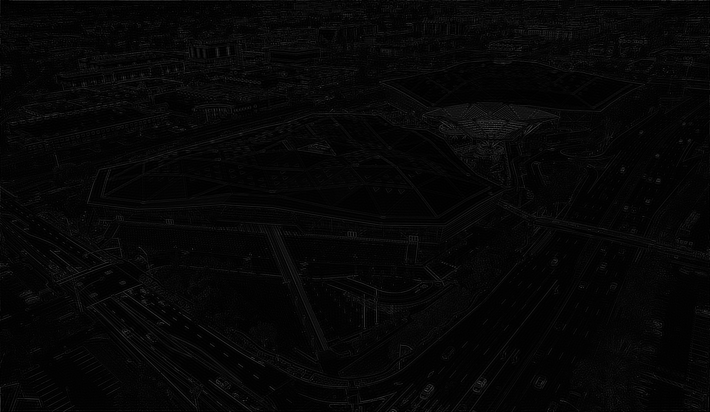
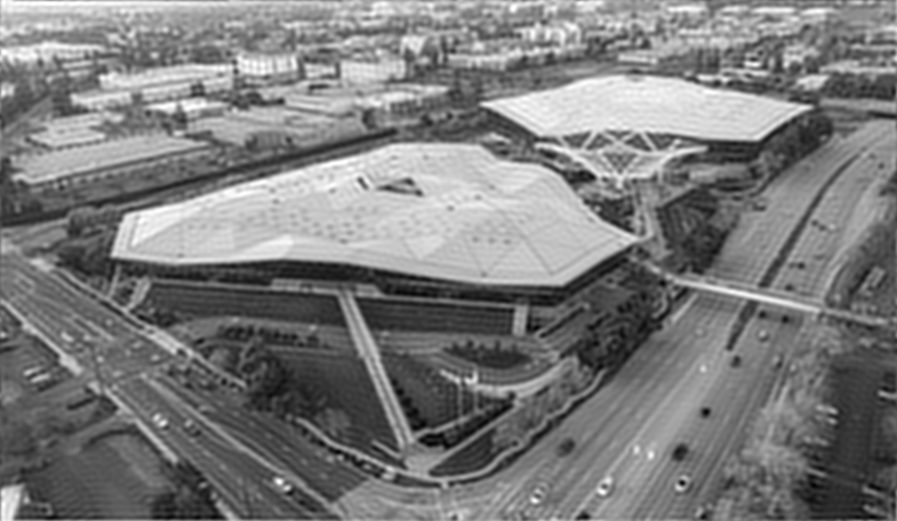

# cuFFT

## Purpose & Prerequisites

cuFFT is a core math library for accelerating the *Fast Fourier Transform (FFT)* algorithm
on NVIDIA GPUs.

### Overview of the Fourier Transform

It's common knowledge that sound is a signal transmitted through air pressure.
Implicitly, you are probably very comfortable with the underlying concept of the Fourier Transform.
You do it with your ears every day. That is, take a signal and "hear" it as its frequencies.
Have you ever turned up the bass in your car? That process involves transforming a signal into
the *frequency domain* and modifying it there instead of the "natural" domain of the signal
(that is, time in the case of sound). 

Jean-Baptiste Joseph Fourier in the early 1800s derived an exact mathematical framework 
for transforming signals into the frequency domain dubbed the *Fourier Transform*.
For finite, discrete data, the continuous methods were adapted into the *Discrete
Fourier Transform (DFT)*. The DFT is an invertible linear transformation: in exact arithmetic,
the original samples can be recovered from their frequency-domain representation. In practice,
floating-point implementations introduce small numerical error.

### Parallelization and Acceleration

Those, even with little experience in accelerated computing, should immediately recognize that
matrix multiplication is an embarrassingly parallel operation. One might naively assume then, that
computationally it makes sense to apply the already optimized matrix multiplication process to a 
DFT. You have, however, been purposefully misled. Deep in the mathematical structure of the DFT lies an 
`O(n log n)` optimization. In 1965, James W. Cooley and John W. Tukey published
[An Algorithm for the Machine Calculation of Complex Fourier Series](https://web.stanford.edu/class/cme324/classics/cooley-tukey.pdf),
which presented a fast algorithm for DFT computation. This was aptly named the *Fast Fourier Transform (FFT)*.

However, the FFT is not truly an "embarrassingly parallel" operation. It falls in the same bucket as
algorithms like a radix sort which require parallel computation, but also synchronization across threads. With 
modern GPU architecture this isn't really a problem. NVIDIA's cuFFT library implements an accelerated FFT for
1D, 2D and 3D signals.

It should be mentioned that many users don't interface with cuFFT directly. Instead they use a front end
like CuPy, PyTorch, or TensorFlow for example which implicitly calls cuFFT. That said, the API is well
documented and is very usable in CUDA C/C++.

### Getting Started with cuFFT

cuFFT is included in the CUDA Toolkit so prerequisites are minimal:

- NVIDIA GPU with associated drivers
- CUDA Toolkit version 13.0 and later
- CUDA compiler `nvcc`

## Installation & Basic Functionality

As mentioned, cuFFT is included as part of the CUDA Toolkit which can be 
downloaded and installed from [here](https://developer.nvidia.com/cuda-downloads).

Typically, the Toolkit is installed (on Linux) at `/usr/local/cuda/` and inside the
installation one can find the cuFFT headers `inc/cufft.h` and the compiled library `lib/cufft.so`.

### Basic Example

Many small examples can be found [here](https://github.com/NVIDIA/CUDALibrarySamples/tree/main/cuFFT).
To illustrate cuFFT on something slightly more meaningful than arrays of sequential data, we apply 
the FFT to images and use it to apply a highpass and a lowpass filter. 

To run the example, first ensure your working directory is the `examples/` folder. Then, compile with
`nvcc image_fft.cu -lcufft` and run the binary.

Sample output is shown below.

  
   
  <em>Input image</em>

  
   
  <em>Log power spectrum</em>

  
   
  <em>Highpass filtered</em>

  
   
  <em>Lowpass filtered</em>

## Relevant Use Case

Asking "but what are the *applications* of the FFT" is a bit like asking "what are the applications
of linear algebra." The Fourier transform unlocks a whole different way of understanding signals and
thus its applications are vast. That said, not all applications require the scale of a GPU accelerated FFT. 
Applications of this acceleration include domains where we need to process large signals fast.

One example is in medical imaging. MRI reconstruction is a particularly important application because the
scanner naturally records data in a frequency-like representation, while clinicians need images in the spatial
domain. In real-time MRI this becomes a problem of throughput. Sequential processing on CPUs just isn't fast
enough to process frames as they're captured. Schaetz et al. describe this in
[Accelerated Computing in Magnetic Resonance Imaging: Real-Time Imaging Using Nonlinear Inverse Reconstruction](https://pmc.ncbi.nlm.nih.gov/articles/PMC5804376/),
where the reconstruction uses batched cuFFT calls across channels, multi-GPU decomposition, and autotuning
to achieve online image reconstruction at high frame rates. In their benchmarks, 
cuFFT outperforms both the CPU implementation FFTW and an accelerated implementation with OpenCL, clFFT
on larger 2D workloads. This is exactly the kind of setting where an accelerated FFT is a core part of
making the application possible.

## Helpful Links

- [Official Documentation](https://docs.nvidia.com/cuda/cufft/)
- [GitHub Repository](https://github.com/NVIDIA/CUDALibrarySamples)
- [NVIDIA Developer Page](https://developer.nvidia.com/cufft)

## Contributor

Gabriel Casselman
