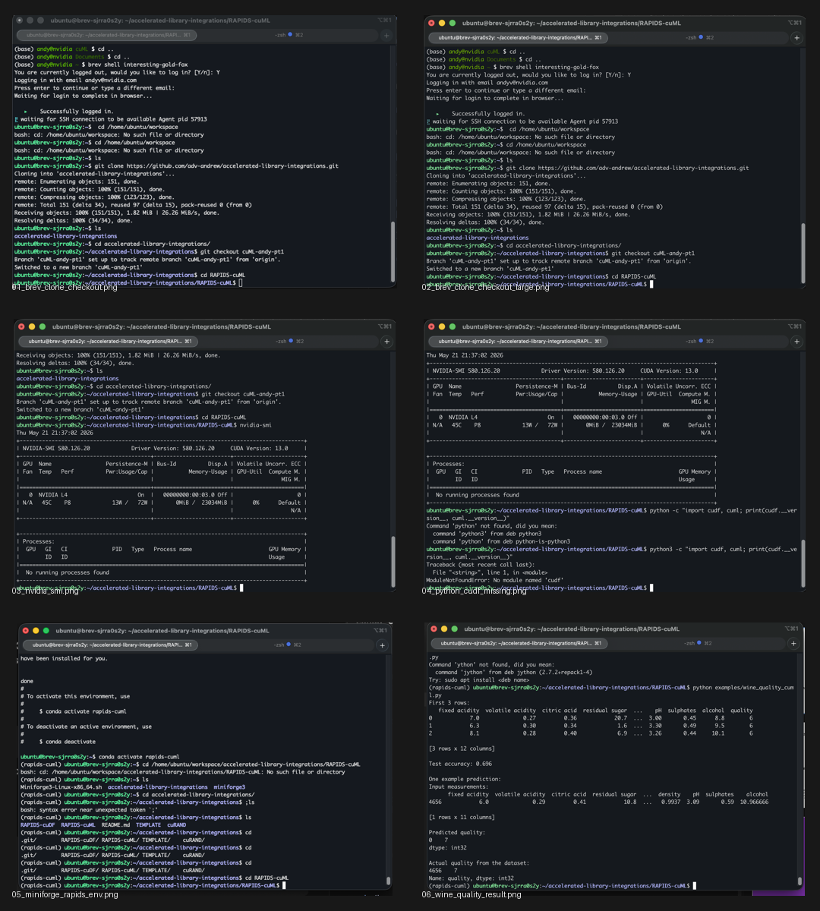

# RAPIDS cuML

cuML is the machine learning library in RAPIDS. The simple way to explain it:

> cuML lets Python data science code train machine learning models on NVIDIA
> GPUs using an API that feels similar to scikit-learn.

This project uses cuML on a small wine quality dataset. The goal is to predict
a wine's quality score from lab measurements like acidity, sugar, pH, density,
and alcohol.

## Purpose & Prerequisites

cuML is useful when a team already has a Python machine learning workflow, but
training or prediction is too slow on CPU. It includes GPU versions of common
classical ML algorithms such as Random Forest, Logistic Regression, SVM, KMeans,
PCA, UMAP, and KNN.

Required:
- Linux or Windows 11 with WSL2
- NVIDIA GPU with CUDA support
- CUDA 12 or CUDA 13 compatible driver
- RAPIDS cuDF and cuML installed

This will not run with cuML on local macOS because Apple Silicon GPUs do not
support CUDA. Use Brev or DGX Spark for the cuML scripts.

## ML Basics For This Demo

- **One row** = one wine sample.
- **Features / X** = the input measurements, such as alcohol and pH.
- **Label / y** = the answer we already know, `quality`.
- **Training** = the model looks at many rows where the answer is known.
- **Testing** = we hide some rows, let the model guess them, and compare its
  guesses to the real answers.
- **Accuracy** = the percent of hidden rows where the model guessed the exact
  quality score.

The `quality` column already has values because the dataset is labeled. ML is
not creating those original values. ML is learning how to predict `quality` for
future rows where the answer is not known yet.

## Installation & Basic Functionality

Use the RAPIDS install selector for the exact command that matches the GPU
machine:

https://docs.rapids.ai/install/

Example conda install:

```bash
conda create -n rapids-cuml -c rapidsai -c conda-forge -c nvidia \
    cudf=26.04 cuml=26.04 python=3.13 cuda-version=12.9
conda activate rapids-cuml
```

Verify the GPU and cuML install:

```bash
nvidia-smi
python examples/install_verification.py
```

Run the basic examples:

```bash
python examples/wine_quality_cuml.py
```

`examples/SETUP.md` has the step-by-step runbook for Brev or DGX Spark.

Example output from running the project on a Brev GPU instance:



## Relevant Use Case

**First Bowl of Soup: Food and beverage quality prediction**

In food and beverage manufacturing, teams collect lab measurements for each
batch. A quality team may want an early estimate of whether a batch is likely
to score well before spending more time on review.

The workflow is:

1. Load batch measurement data with cuDF.
2. Separate the input columns from the known quality score.
3. Train a cuML model on the GPU.
4. Test the model on rows it did not train on.
5. Use the prediction as one signal in a quality dashboard or partner product.

This connects to AIPS:

- **Accelerate:** use NVIDIA GPUs to speed up model training and prediction.
- **Integrate:** swap a familiar scikit-learn style workflow to RAPIDS cuML.
- **Promote:** show a simple customer story around quality analytics.
- **Sell:** explain where GPU-accelerated ML fits in a real workflow.

## Files

- `examples/install_verification.py` - checks RAPIDS imports and GPU access.
- `examples/wine_quality_cuml.py` - GPU version for Brev or DGX Spark.
- `dataset/winequality-white.csv` - dataset used by the examples.

## Helpful Links

- [Official Documentation](https://docs.rapids.ai/api/cuml/stable/)
- [Installation Guide](https://docs.rapids.ai/install/)
- [GitHub Repository](https://github.com/rapidsai/cuml)
- [NVIDIA Developer Page](https://developer.nvidia.com/rapids)

## Contributor

Andy V
